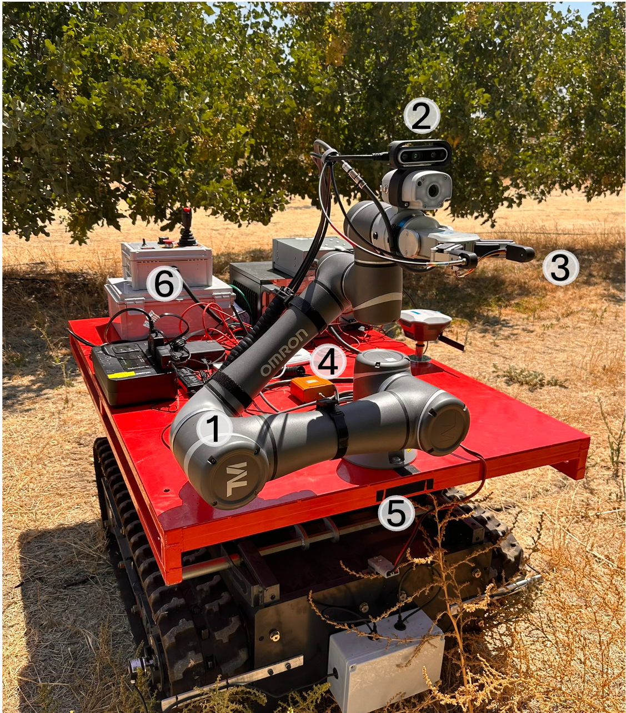

# **RoMu4o: A Robotic Manipulation Unit for Orchard Operations**

RoMu4o, is a robotic manipulation unit for orchard operations, designed to provide an autonomous solution for continuous orchard monitoring. This robotic system is capable of navigating unstructured agricultural environments for crop monitoring and proximal hyperspectral leaf sensing. The hardware is comprised of 1) 6-DOF robotic manipulator 2) RGBD camera 3) two-finger gripper end-effector integrated with a hyperspectral sensing system 4) an independent VIS-NIR light source for referencing and self-calibration 5) crawler-type ground robot 6) electric and control boxes, hardware drivers, portable batteries, processing unit, Ethernet hub, and auxiliary hardware needed for the UGV's navigation.



## **Repository structure**

```
UCM-AgBot-ROS2/
├── agbot/                   # Main robot packages
│   │
│   ├── robot_bringup/       # RoMu4o launch files and setup
│   ├── robot_control/       # Mobile Robot control 
│   ├── robot_description/   # URDF and robot model 
│   └── robot_simulator/     # Simulation setup 
│
├── cobot/                   # TM5 collaborative arm 
├── custom_interfaces/       # Custom messages and services
├── devices/                 # Driver packages
├── sensors/                 # Driver packages
├── vision/                  # Perception module
├── .gitignore               
├── .gitmodules              # Forked Repositories
├── LICENSE                  
└── README.md                # Project documentation
```


## **Requirements**

- [Ubuntu 20.04](https://releases.ubuntu.com/20.04/)  
- [ROS2 (Foxy)](https://docs.ros.org/en/foxy/Installation.html)  
- [MoveIt2 (Foxy)](https://moveit.ai/install-moveit2/binary/)
- [NAV2 (Foxy)](https://docs.nav2.org/getting_started/index.html)


## **Forked Repositories**  

- [RealSense D435i](https://github.com/mehradmrt/realsense-ros)  
- [TM/OMRON TM5M-900](https://github.com/mehradmrt/tmr_ros2)  
- [Vectornav](https://github.com/mehradmrt/vectornav)  
- [Slamtec](https://github.com/Slamtec/sllidar_ros2)


## **Installation**

1. **Create a ROS2 workspace**:  
    ```bash
    mkdir -p ~/ros2_ws/src
    cd ~/ros2_ws/src
    ```

2. **Clone the repository**:  
    ```bash
    git clone --recurse-submodules https://github.com/mehradmrt/UCM-AgBot-ROS2
    ```

3. **Return to the workspace root**:  
    ```bash
    cd ../
    ```

4. **Install ROS dependencies**:  
    ```bash
    rosdep update
    rosdep install --from-paths src --ignore-src -r -y
    ```

5. **Build the workspace**:  
    ```bash
    colcon build
    ```

6. **Source the environment**:  
    ```bash
    source /opt/ros/foxy/setup.bash
    source install/setup.bash
    ```

---

## **Usage**

### **RoMu4o Navigation**

1. **Launch sensors and devices**:  
    ```bash
    ros2 launch robot_bringup sensors.launch.py imu:=true gnss:=true lidar2d:=true realsense:=true encoders:=true
    ```

2. **Launch robot bringup**:  
    ```bash
    ros2 launch robot_bringup bringup.launch.py
    ```

3. **Launch robot localization**:  
    ```bash
    ros2 launch robot_bringup localization.launch.py
    ```

4. **Launch robot navigation**:  
    ```bash
    ros2 launch robot_bringup navigation.launch.py
    ```

### **RoMu4o Perception and Leaf Manipulation**

1. **Launch sensors and devices**:  
    ```bash
    ros2 launch robot_bringup sensors_arm.launch.py
    ```

2. **Launch the robotic manipulation pipeline**:  
    ```bash
    ros2 launch tm_moveit_cpp_demo tm5-900_run_moveit_cpp.launch.py robot_ip:=192.168.1.19
    ```

3. **Run the perception pipeline**:  
    ```bash
    ros2 run leaf_extraction instance_segmentation
    ```

---

## **Reference**

```
Mortazavi, M., Cappelleri, D.J., Ehsani, R., 2025. RoMu4o: A Robotic Manipulation Unit
For Orchard Operations Automating Proximal Hyperspectral Leaf Sensing. arXiv preprint 
arXiv:2409.19786.
```